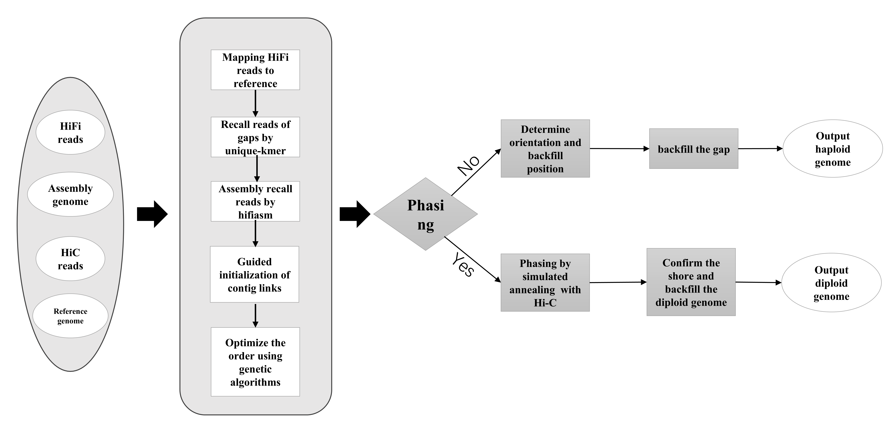
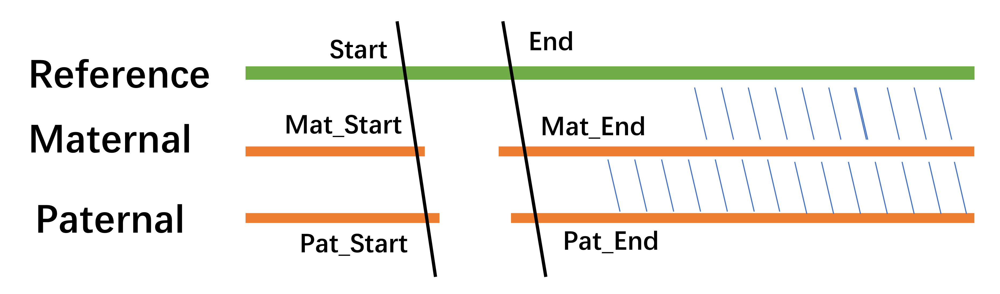

# <center>TRFill</center>

TRFill is a chromosom-level gap-filling tool that leverages fully assembled homologous genomes, HiFi/ONT reads, and Hi-C reads to fill gaps in complex repetitive regions of T2T assemblies. It supports diploid genotype assembly for complex region gaps and has demonstrated high performance in filling gaps in human (HG002) and tomato genomes.


## Contents
- [Introduction](#introduction)
- [Installation](#installation)
- [Usage](#usage)
- [Others](#others)
- [Citations](#citations)
- [Contact](#contact)

## The workflow of pipline for trfill is as follows  
  


## Introduction
TRFill is a genomic gap-filling tool that relies on fully assembled homologous genomes, HiFi reads, and Hi-C reads. TRFill can fill gaps in complex repetitive regions of T2T assemblies and supports diploid genotype assembly for complex region gaps. In our tests, TRFill has demonstrated excellent performance in filling gaps in the human genome HG002 and several tomato genomes.

## Installation
TRFill consists of submodules in C++ (gcc/g++ 9.0+ is required) and Python 3.7+, ultimately assembled into a pipeline using shell scripts. During its operation, it relies on **[hifiasm](https://github.com/chhylp123/hifiasm.git)**, **[winnowmap](https://github.com/marbl/Winnowmap.git)**, and **[jellyfish](https://github.com/gmarcais/Jellyfish.git)**. All the required program need to be included in the environment path. Despite having multiple functional submodules, TRFill can be easily obtained and installed using the following command.  

- **Software Requirements**:
  - C++ compiler (gcc/g++ 9.0+)
  - Python 3.7+
  - [Hifiasm](https://github.com/chhylp123/hifiasm) > V0.21.0-r686 
  - [Winnowmap](https://github.com/marbl/Winnowmap) v2.03
  - [Jellyfish](https://github.com/gmarcais/Jellyfish) v2.3.1

### Installing
```sh
# get software
git clone --depth 1 https://github.com/panlab-bioinfo/TRFill.git
# Compile c++ programs 
cd TRFill/src && make
cd ..
# add the dictionary to environment variable
export PATH=$PATH:$(pwd)
# pilot run
trfill_main.sh
```
### Sample test
We provide a small sample dataset to test whether the program installed successfully. You can unzip it and test by the following command:

```sh
# unzip the sample file
tar -Jxvf sample.tar.xz
cd sample
../trfill_main.sh -c config.txt -o result
```  

If the test workflow finished (The screen show the words: TRFill running finished!), the TRFill program install successfully.  


## Usage
### 1. Main Program Usage  

Workflow of TRFill is easy to run as follow:  

```sh
Usage: /data/yangjinbao/software/TRFill/trfill [-t THREADS] [-o OUTPUT_PATH] [-f [HiFi/ONT]] [-p] [-b] [-h] -c CONFIG_FILE
Required:
  -c CONFIG_FILE    Path to the configuration file
Options:
  -t THREADS        Number of threads to use (default: 32)
  -o OUTPUT_PATH    Path to output directory (default: './')
  -f Reads_format   Input format of reads for assembly [HiFi/ONT] (default: HiFi)
  -p                When this parameter is enabled, TRFill will conduct phasing assembly for gap regions
  -b                When the format of hifi reads is bam, this parameter is required
  -h                Display this help message
  -w                Use Hi-C to determined the orientation filled back
```

This is a common usage sample:  
`./trfill_main.sh -t 32 -o trf_result -c haploid.config.txt`  


### 2. Input
The key parameter for TRFill are specified in two configuration files. Depending on the assembly type, you should use either haploid.config.txt for haploid assembly or diploid.config.txt for diploid assembly. Use the -c option to specify the path to the appropriate configuration file. The templates for these two configuration files are located in the main directory of TRFill.

**2.1 For haploaid assembly:**
```sh
trfill_main.sh -o result -c haploid.config.txt
```
The details of the haploid config as follow.

```  
# This config file is for haploaid assembly 
# All file must be use absolute path

# Reference genome with T2T level for guiding assembly
reference=/data/chm13/T2Tassembly/chm13v2.0.merge.fa

# The current assembly genome need filling the gap that must be Chromesome level genome and use the same Chromosome id.
assembly=/data/HG002/assembly/HG002.fa

# HiFi or ONT reads of current assembly. The format supports fastq/fastq.gz/bam
reads=/data/HG002/hifi/high/m64015_190922_010918.Q20.fastq 

# HiC reads, The format supports fa/fastq/fastq.gz
hic_reads1=/data/HG002/hic/high/HG002.HiC_2_NovaSeq_rep1_run2_S1_L001_R1_001.fastq
hic_reads2=/data/HG002/hic/high/HG002.HiC_2_NovaSeq_rep1_run2_S1_L001_R2_001.fastq

# List of chromosomes that need gap filling
chrs=("chr13" "chr14" "chr15" "chr21" "chr22")

# Start and end positions of the gap regions in the reference genome
starts=(15511991 10096873 15035508 11002840 12317333)
ends=(17561453 12679517 17652018 11303875 16654016)

# Actual start and end positions of the gap regions in the current assembly (i.e., the true gap coordinates)
gap_starts=(4041615 7694226 7879462 4222934 5408063)
gap_ends=(15471497 8737488 9300453 463125 5603233)
```
- `chrs`: This array lists the names of the chromosomes that require gap filling (reference and current assembly have the same chr id/name).
- `starts` and `ends`: These arrays define the start and end positions of the gap regions in the reference genome. The corresponding indices in the `starts` and `ends` arrays represent the gap regions for each chromosome listed in the `chrs` array.
- `gap_starts` and `gap_ends`: These arrays define the actual start and end positions of the gap regions in the current assembly (i.e., the true gap coordinates).  

**Note:** The starts and ends positions of the gap in chrs in reference genome correspond to the same indices of starts and ends respectively.


**2.2 For diploid assembly:**
When performing diploid assembly, an additional parameter -p must be included to indicate that the assembly is for a diploid genome. Below are examples of how to use these options: 
```sh
trfill_main.sh -p -o result -c diploid.config.txt
```
The configuration file for diploid mode is mostly similar to that of haploid mode. The key differences are:

1. `assembly_mat` and `assembly_pat`: Two genomes of Phased Assemblies: You need to provide two sets of phased current assemblies: one for the maternal haplotype and another for the paternal haplotype.
2. `mat_starts` `pat_starts` `mat_ends` `pat_ends`:Additionally, you must supply the Gap Coordinates on both the maternal and paternal haplotypes.  

Here is the configuration information for diploid mode:

```
# Parameters for diploid mode

reference=/data/chm13/T2Tassembly/chm13v2.0.merge.fa

# Maternal and paternal assemblies
assembly_mat=/data/HG002/assembly/HG002.mat.chr.fa
assembly_pat=/data/HG002/assembly/HG002.pat.chr.fa

# HiFi or ONT reads of current assembly. The format supports fastq/fastq.gz/bam
reads=/data/HG002/hifi/m64015_190922_010918.Q20.fastq

# HiC reads
hic_reads1=/data/HG002/hic/HG002.R1.fastq
hic_reads2=/data/HG002/hic/HG002.R2.fastq

# Reference chromosomes
chrs=("chr13" "chr14" "chr15" "chr21" "chr22")

# Reference start and end positions of every chrs
starts=(15511991 10096873 15035508 11002840 12317333)
ends=(17561453 12679517 17652018 11303875 16654016)

# phasing=1, the mat hap
mat_starts=(4041615 7694226 7879462 4222934 5408063)
mat_ends=(4287078 8558319 10395169 5049388 8250405)

# phasing=1, the pat hap
pat_starts=(14028568 6975733 7060302 128989 1846531)
pat_ends=(15471497 8737488 9300453 463125 5603233)
```  
**NOTE: All file paths in contig.txt must use absolute paths.**  


**Chromesome of reference and index of gap**  
The indices of the parameters **chrs, starts, and ends** correspond to each other. For example, the first item in chrs is ***chr13***, the first index in starts represents the start position of a gap in ***chr13***, and the first item in ends indicates the end position of that gap in ***chr13***. The same applies to **mat_starts/ends and pat_starts/ends**. It is important to note that the reference itself has no gaps; gaps exist in the current assembly. 

The coordinate boundaries (starts/ends) of gaps in the current assembly relative to the reference genome can be determined using **[Syri](https://github.com/schneebergerlab/syri.git)** for collinearity analysis. As shown in the figure below, for diploid assemblies, the coordinates on the reference genome need to fully cover the gaps on both the maternal and paternal haplotypes. For a specific coordinate on the reference genome, the corresponding coordinates on the maternal and paternal haplotypes should align with the reference coordinates rather than the original gap positions. 

  

### 3. Option parameters  
`-f`: ONT reads can be supported and use this param to enable. But hifi is highly recommended because of the high accuracy.  
`-b`: For hifi reads input, the format can use bam and TRFill will use `samtools` to switch the bam to fastq. 
`-w`: This parameter is use hic to determine the direction of gap backfilling and the `minimap2` required.

### 4. Output

1. The filled chromosomes seq are in the path of `result/final_result`  
2. For haploid samples, the sequence of gap produced by TRFill is in `result/chrN/scaffolding/hifi_paf_link.available.fa`  
3. For diploid samples, the two phasing sequences of gap is in `result/filled_result/gap_seq/*`  


## Others
Pending replenishment

## Citations
The TRFill software and correlated algorithm is published in **Jounal(unpublished)**. If you use TRFill, please cite this paper as follows:
****************************************

## Contact
This software is developed by Professor Wei-Hua Pan's team at the Shenzhen Institute of Genome Research, Chinese Academy of Agricultural Sciences. The various functional modules are implemented by Hua-Ming Wen, while the main program integration and this README are completed by Jin-Bao Yang.

If you have any questions or concerns while using the software, please submit an issue in the repository or contact us through the following methods:

### Email:  

**Prof. Pan:**  panweihua@caas.cn  
**Yang Jinbao:**  yangjinbao@caas.cn